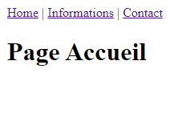

# Exercice site Laure Dinateur en SPA

## Avant de démarrer l'exercice

1. Cloner ce dépôt
2. Télécharger les paquets `npm install`
3. Formater les fichiers `npm run format`
4. Fixer les erreurs de codage `npm run lint`
5. Créer une nouvelle branche pour démarrer l'exercice

## Commandes utiles
### Télécharger les paquets
```sh
npm install
```

### Démarrer le serveur de développement
```sh
npm run dev
```

### Formatage du code
```sh
npm run format
```

### Compiler et minimiser pour la production
```sh
npm run build
```

### Fixer les erreurs de codage avec [ESLint](https://eslint.org/)
```
npm run lint
```

## Objectifs de l'exercice

Transformer le site de Laure Dinateur https://kode.ch/101/lauredi/ en SPA en utilisant :
* Vue.js V2 : https://fr.vuejs.org/v2/guide/
* Vue CLI : https://cli.vuejs.org/
* Vue router : https://router.vuejs.org/
* Composants monofichiers

**Vous trouverez une copie du site statique Laure Dinateur
dans le dossier `templates/` de ce projet.**

## Étapes

### Étape 1 - Cloner le dépôt, télécharger les paquets et créer une nouvelle branche

### Étape 2 - Création des pages et navigation (Vue router)



* Créer les pages `PageAccueil.vue`, `PageContact.vue` et `PageInformations.vue`
  dans `src/views/` avec uniquement un `<h1>` contenant le titre de la page.
* Définir les routes dans `src/router/index.js`, et les tester.
* Création d'un menu de navigation `<router-link>` sommaire
  dans `src/App.vue` et ajout du `<router-view>`.

### Étape 3 - Intégration des contenus HTML/CSS et images
* Copie des images : copier les images dans : `public/img/`
* Copie des CSS dans : `public/css/`
* Modification de `public/index.html`
  pour y lier les CSS et modifier les autres informations (titre, icône, ...)
* Création de composants pour l'entête le pied de page
* Ajout du HTML dans l'entête et le pied de page
* Ajout du HTML dans les différentes pages
* Ajout de la classe "actif" au lien actif du menu.
* (optionnel) Ajouter le code CSS spécifique aux pages
  dans les composants de page `PageAccueil.vue`, `PageContact.vue` et `PageInformations.vue`

### Étape 4 - Création d'un magasin de données pour les réalisations
* Ajouter des data au composant `PageAccueil.vue`
  représentant les réalisations (image, titre, description) de la page d'accueil.
* Parcourir les data pour générer l'affichage des réalisations.

### Étape 5 - Créer un composant `Realisation.vue` 
* Créer un composant représentant une réalisation avec un ou plusieurs propriétés (props)
lui permettant de recevoir les données de la réalisation.

### Étape 6 - Modifier le titre du document HTML `<title>` 
* Ajouter le lifecycle hook `beforeMount` aux pages `PageAccueil.vue`, `PageContact.vue` et `PageInformations.vue`
* Utiliser `document.title` pour modifier le titre du document en fonction de la page :
  * `PageAccueil.vue` => `"Laure Dinateur | Graphiste"`
  * `PageContact.vue` => `"Me contacter | Laure Dinateur"`
  * `PageInformations.vue` => `"Informations | Laure Dinateur"`

### Étape 7 - Modifier le titre du document HTML via le routeur `<title>`
* Changer le titre du document à chaque changement de route en utilisant
  l'intercepteur de navigation `router.afterEach((to, from)`
  https://router.vuejs.org/fr/guide/advanced/navigation-guards.html#intercepteurs-de-navigation
* Ajouter une propriété `titre` au champ meta de route
  https://router.vuejs.org/fr/guide/advanced/meta.html#champs-meta-de-route
* Note : Effectuer le changement du titre de la page dans un `Vue.nextTick`
  https://fr.vuejs.org/v2/guide/reactivity.html#File-d%E2%80%99attente-de-mise-a-jour-asynchrone

